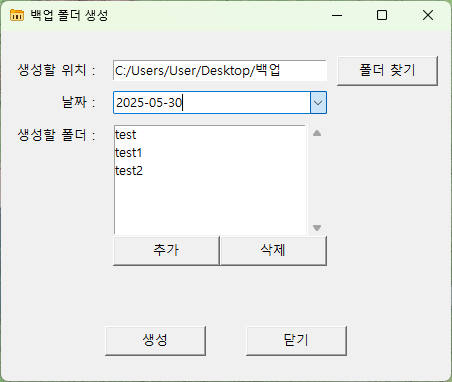
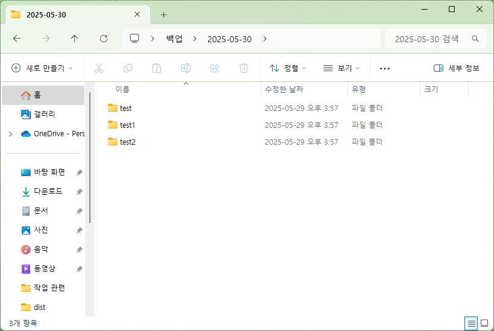

<p align="center"></p>
<p align="center"></p>
<hr>
<br>

## 👩🏻‍💻 프로젝트 소개
반복적인 백업 폴더 생성 작업을 자동화하기 위해 만든 개인용 Python GUI 툴입니다.
- **개발 기간** : 2025-05-13 ~ 2025-05-29

<br>

## ⚙ 개발 환경
- **Python** 3.13.1
- **Tkinter** – GUI 구성
- **tkcalendar** – 날짜 선택 기능 구현에 사용
  ```bash
  pip install tkcalendar
  ```
- **Pyinstaller** – 실행 파일(.exe)로 패키징
  ```bash
  pip install pyinstaller
  ```
  ```bash
  pyinstaller --onefile --windowed --icon=app_icon.ico --add-data "app_icon.png;." main.py
  ```
  
<br>

## 🛠️ 주요 기능
- 원하는 위치에 폴더 생성 가능
- 날짜를 기준으로 상위 폴더명 자동 생성 (혹은 날짜 선택 가능)
- 하위 폴더명 추가 및 삭제 기능으로 유연한 구조 설계
- 이전 작업 기록 자동 저장으로 반복 입력 없이 같은 구조로 바로 생성 가능
<table align="center">
  <tr>
    <th>GUI 구성</th>
    <th>결과물</th>
  </tr>
  <tr>
    <td></td>
    <td></td>
  </tr>
</table>

<br>

🗓 README 최종 수정일 : 2025-05-29
